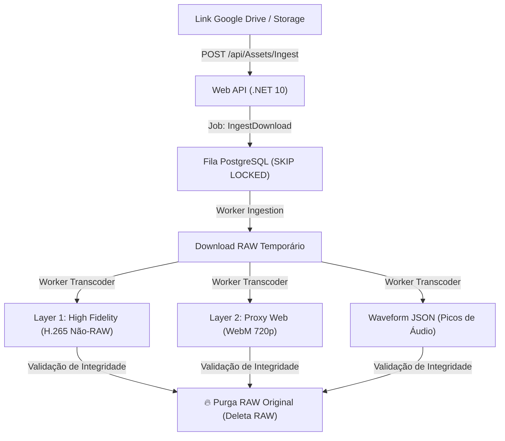

# 02 — Regras do Domínio Core & Esteira de Mídias

> **Matriz de Documentação — Pilar 3: Regras de Negócio & Fluxos do Domínio**  
> *Versão:* 1.0.0  
> *Status:* Ativo  

---

## 1. O "Crown Jewel" da Aplicação

O coração do **Media 8 | Workstation** é a **Esteira Assíncrona de Mídias com Purga Defensiva de RAW**. O sistema resolve o problema de gigabytes/terabytes ocupados por arquivos brutos de câmeras (ex: vídeos 8K de 20 GB) sem exigir investimento em infraestruturas broadcast milionárias.

---

## 2. Pipeline de Transcodificação Dual-Layer

Quando um link externo (ex: Google Drive) é enviado para uma Order:

1. **Camada High Fidelity (Não-RAW):** Transcodifica o RAW para H.265 / ProRes otimizado com alto bitrate, reduzindo drasticamente o consumo em disco sem perda de qualidade visível para a edição final.
2. **Camada Proxy Web:** Transcodifica para WebM 720p leve, permitindo streaming fluido no browser com início de reprodução em menos de 1.5s (`movflags +faststart`).
3. **Picos de Áudio (Waveform JSON):** Extração dos picos de áudio compilados em um JSON compacto para renderização gráfica em Canvas 2D no React.
4. **Purga Defensiva:** Deleta o arquivo RAW original do disco local imediatamente após validar os arquivos otimizados.

---

## 3. Player Broadcast & Marcação de Sub-clips

- **Precisão por Quadro (Frame-Accurate Timecode):** Player React visualiza o tempo exato no formato `HH:MM:SS:FF` baseado na taxa de quadros (FPS) da mídia.
- **Atalhos de Teclado Broadcast:**
  - `J`: Retroceder velocidade (0.5x, 0.25x)
  - `K` / `Espaço`: Pausar / Play
  - `L`: Avançar velocidade (2x, 4x)
  - `Seta Esquerda / Direita`: Avançar / Voltar 1 frame exatamente
  - `I`: Marcar Ponto de Entrada (IN)
  - `O`: Marcar Ponto de Saída (OUT)
- **Integração Briefing ↔ Timecode:** Os marcadores salvos vinculam-se ao texto de briefing da Order, permitindo que o editor salte diretamente para os pontos de interesse marcados pelo cliente.
