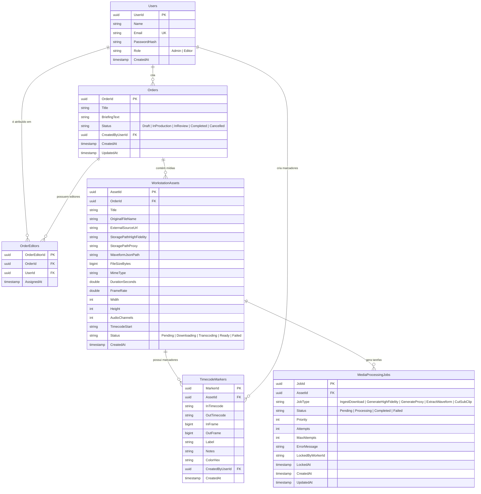

# Media 8 | Workstation — Banco de Dados & Esquema ERD

> **Modelo Relacional e DDL PostgreSQL**  
> *Versão:* 1.0.0  
> *Convenção:* PascalCase Rigoroso (Nomes de Tabelas e Colunas)  

---

## 1. Diagrama Entidade-Relacionamento (ERD)



---

## 2. Script DDL PostgreSQL (PascalCase Rigoroso)

```sql
-- =============================================================================
-- Media 8 | Workstation - PostgreSQL Database Schema Setup
-- Engine: PostgreSQL 16+
-- Convenção de Nomes: PascalCase (Requer uso de aspas duplas em tabelas e colunas)
-- =============================================================================

-- Habilitar Extensões Fundamentais
CREATE EXTENSION IF NOT EXISTS "uuid-ossp";
CREATE EXTENSION IF NOT EXISTS "vector";

-- -----------------------------------------------------------------------------
-- 1. Tabela: Users (Usuários e RBAC)
-- -----------------------------------------------------------------------------
CREATE TABLE "Users" (
    "UserId" UUID PRIMARY KEY DEFAULT uuid_generate_v4(),
    "Name" VARCHAR(150) NOT NULL,
    "Email" VARCHAR(255) NOT NULL UNIQUE,
    "PasswordHash" VARCHAR(255) NOT NULL,
    "Role" VARCHAR(50) NOT NULL DEFAULT 'Editor', -- 'Admin', 'Editor'
    "CreatedAt" TIMESTAMP WITH TIME ZONE DEFAULT CURRENT_TIMESTAMP
);

-- -----------------------------------------------------------------------------
-- 2. Tabela: Orders (Projetos de Edição)
-- -----------------------------------------------------------------------------
CREATE TABLE "Orders" (
    "OrderId" UUID PRIMARY KEY DEFAULT uuid_generate_v4(),
    "Title" VARCHAR(255) NOT NULL,
    "BriefingText" TEXT,
    "Status" VARCHAR(50) NOT NULL DEFAULT 'Draft', -- 'Draft', 'InProduction', 'InReview', 'Completed', 'Cancelled'
    "CreatedByUserId" UUID NOT NULL REFERENCES "Users"("UserId") ON DELETE RESTRICT,
    "CreatedAt" TIMESTAMP WITH TIME ZONE DEFAULT CURRENT_TIMESTAMP,
    "UpdatedAt" TIMESTAMP WITH TIME ZONE DEFAULT CURRENT_TIMESTAMP
);

-- -----------------------------------------------------------------------------
-- 3. Tabela: OrderEditors (Junção RBAC: Editores Atribuídos a cada Order)
-- -----------------------------------------------------------------------------
CREATE TABLE "OrderEditors" (
    "OrderEditorId" UUID PRIMARY KEY DEFAULT uuid_generate_v4(),
    "OrderId" UUID NOT NULL REFERENCES "Orders"("OrderId") ON DELETE CASCADE,
    "UserId" UUID NOT NULL REFERENCES "Users"("UserId") ON DELETE CASCADE,
    "AssignedAt" TIMESTAMP WITH TIME ZONE DEFAULT CURRENT_TIMESTAMP,
    CONSTRAINT "UQ_OrderEditors_Order_User" UNIQUE ("OrderId", "UserId")
);

-- -----------------------------------------------------------------------------
-- 4. Tabela: WorkstationAssets (Mídias da Order)
-- -----------------------------------------------------------------------------
CREATE TABLE "WorkstationAssets" (
    "AssetId" UUID PRIMARY KEY DEFAULT uuid_generate_v4(),
    "OrderId" UUID NOT NULL REFERENCES "Orders"("OrderId") ON DELETE CASCADE,
    "Title" VARCHAR(255) NOT NULL,
    "OriginalFileName" VARCHAR(255) NOT NULL,
    "ExternalSourceUrl" TEXT NOT NULL,
    "StoragePathHighFidelity" TEXT,
    "StoragePathProxy" TEXT,
    "WaveformJsonPath" TEXT,
    "FileSizeBytes" BIGINT NOT NULL DEFAULT 0,
    "MimeType" VARCHAR(100) NOT NULL DEFAULT 'video/mp4',
    "DurationSeconds" DOUBLE PRECISION DEFAULT 0.0,
    "FrameRate" DOUBLE PRECISION DEFAULT 29.97,
    "Width" INT DEFAULT 0,
    "Height" INT DEFAULT 0,
    "AudioChannels" INT DEFAULT 2,
    "TimecodeStart" VARCHAR(12) DEFAULT '00:00:00:00',
    "Status" VARCHAR(50) NOT NULL DEFAULT 'Pending', -- 'Pending', 'Downloading', 'Transcoding', 'Ready', 'Failed'
    "CreatedAt" TIMESTAMP WITH TIME ZONE DEFAULT CURRENT_TIMESTAMP
);

-- -----------------------------------------------------------------------------
-- 5. Tabela: TimecodeMarkers (Sub-clips e Cortes IN/OUT)
-- -----------------------------------------------------------------------------
CREATE TABLE "TimecodeMarkers" (
    "MarkerId" UUID PRIMARY KEY DEFAULT uuid_generate_v4(),
    "AssetId" UUID NOT NULL REFERENCES "WorkstationAssets"("AssetId") ON DELETE CASCADE,
    "InTimecode" VARCHAR(12) NOT NULL DEFAULT '00:00:00:00',
    "OutTimecode" VARCHAR(12) NOT NULL DEFAULT '00:00:00:00',
    "InFrame" BIGINT NOT NULL DEFAULT 0,
    "OutFrame" BIGINT NOT NULL DEFAULT 0,
    "Label" VARCHAR(255) NOT NULL,
    "Notes" TEXT,
    "ColorHex" VARCHAR(7) DEFAULT '#FF0000',
    "CreatedByUserId" UUID NOT NULL REFERENCES "Users"("UserId") ON DELETE CASCADE,
    "CreatedAt" TIMESTAMP WITH TIME ZONE DEFAULT CURRENT_TIMESTAMP
);

-- -----------------------------------------------------------------------------
-- 6. Tabela: MediaProcessingJobs (Fila de Tarefas Database-as-a-Queue)
-- -----------------------------------------------------------------------------
CREATE TABLE "MediaProcessingJobs" (
    "JobId" UUID PRIMARY KEY DEFAULT uuid_generate_v4(),
    "AssetId" UUID NOT NULL REFERENCES "WorkstationAssets"("AssetId") ON DELETE CASCADE,
    "JobType" VARCHAR(50) NOT NULL, -- 'IngestDownload', 'GenerateHighFidelity', 'GenerateProxy', 'ExtractWaveform', 'CutSubClip'
    "Status" VARCHAR(50) NOT NULL DEFAULT 'Pending', -- 'Pending', 'Processing', 'Completed', 'Failed'
    "Priority" INT NOT NULL DEFAULT 10,
    "Attempts" INT NOT NULL DEFAULT 0,
    "MaxAttempts" INT NOT NULL DEFAULT 3,
    "ErrorMessage" TEXT,
    "LockedByWorkerId" VARCHAR(100),
    "LockedAt" TIMESTAMP WITH TIME ZONE,
    "CreatedAt" TIMESTAMP WITH TIME ZONE DEFAULT CURRENT_TIMESTAMP,
    "UpdatedAt" TIMESTAMP WITH TIME ZONE DEFAULT CURRENT_TIMESTAMP
);

-- -----------------------------------------------------------------------------
-- ÍNDICES DE ALTA PERFORMANCE
-- -----------------------------------------------------------------------------

-- Índice Parcial Crítico para Consumo de Fila com SKIP LOCKED (Worker Processing)
CREATE INDEX "IX_MediaProcessingJobs_Queue"
ON "MediaProcessingJobs" ("Status", "Priority" DESC, "CreatedAt" ASC)
WHERE "Status" = 'Pending';

-- Índices de Chaves Estrangeiras e Consultas Frequentes
CREATE INDEX "IX_Orders_CreatedByUserId" ON "Orders" ("CreatedByUserId");
CREATE INDEX "IX_OrderEditors_OrderId" ON "Orders" ("OrderId");
CREATE INDEX "IX_OrderEditors_UserId" ON "OrderEditors" ("UserId");
CREATE INDEX "IX_WorkstationAssets_OrderId" ON "WorkstationAssets" ("OrderId");
CREATE INDEX "IX_WorkstationAssets_Status" ON "WorkstationAssets" ("Status");
CREATE INDEX "IX_TimecodeMarkers_AssetId" ON "TimecodeMarkers" ("AssetId");
```

---

## 3. Mecânica do Consumo da Fila (`SKIP LOCKED`)

Os Workers em C# .NET 10 executam a consulta SQL atômica abaixo para reservar e capturar tarefas pendentes sem bloqueios ou colisões entre múltiplos containers:

```sql
UPDATE "MediaProcessingJobs"
SET "Status" = 'Processing',
    "LockedByWorkerId" = @WorkerId,
    "LockedAt" = NOW(),
    "Attempts" = "Attempts" + 1,
    "UpdatedAt" = NOW()
WHERE "JobId" = (
    SELECT "JobId"
    FROM "MediaProcessingJobs"
    WHERE "Status" = 'Pending'
    ORDER BY "Priority" DESC, "CreatedAt" ASC
    FOR UPDATE SKIP LOCKED
    LIMIT 1
)
RETURNING "JobId", "AssetId", "JobType", "Attempts";
```
