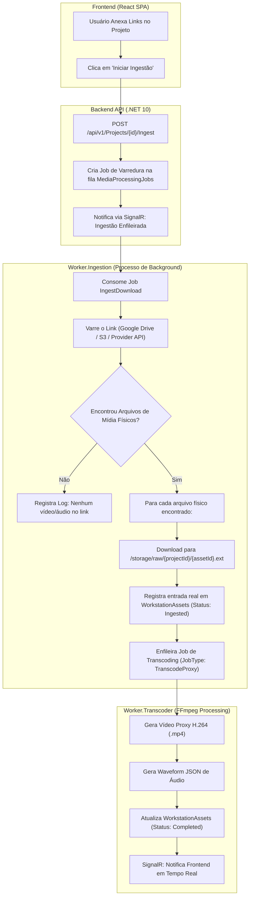

# Esteira de Ingestão & Catalogação de Mídias (Arquitetura & Especificação)

> **Documento de Arquitetura & Estudo de Caso**  
> **Sistema**: Media 8 Workstation PAM  
> **Versão**: 1.0.0  
> **Data**: Julho de 2026  

---

## 1. Visão Geral & Princípios Fundamentais

No ecossistema **Media 8 Workstation PAM (Pluggable Asset Management)**, existe uma separação técnica rigorosa entre a **Origem de Mídia (Link)** e a **Mídia Processada (Asset)**.

### 🔑 Regras de Domínio Fundamentais:
1. **Link Anexado (`ProjectLink`) ≠ Mídia (`WorkstationAsset`)**:
   - Um `ProjectLink` é um endereço de repositório remoto (ex: pasta no Google Drive, Bucket S3, Link Vimeo/YouTube, pasta Dropbox).
   - Um `ProjectLink` pode conter **zero, um ou múltiplos arquivos físicos de mídia** (vídeos `.mp4`, `.mov`, áudios `.wav`, `.mp3`).
   - A quantidade de links de um projeto não define a quantidade de mídias do projeto.

2. **Mídia Fisicamente Baixada/Catalogada (`WorkstationAsset`)**:
   - Um `WorkstationAsset` representa um **arquivo de mídia único e individual** descoberto e registrado no banco de dados.
   - O contador de mídias de um projeto exibe estritamente a quantidade de entidades `WorkstationAsset` reais que foram fisicamente varridas, ingeridas e validadas.

3. **Versões de um Ativo (`AssetVersion` / Storage Paths)**:
   - Uma mídia catalogada pode possuir múltiplas representações em disco:
     - **RAW / High-Fidelity**: O arquivo fonte original em alta qualidade.
     - **Low-Fidelity / Proxy**: A versão comprimida em H.264/WebM otimizada para reprodução fluída no player da estampa de corte no navegador.
     - **Waveform Canvas 2D**: O mapa JSON de amplitudes de áudio extraído via FFmpeg.
   - **Importante**: Múltiplas versões de um arquivo **não dobram** a contagem de mídias. 1 Mídia com 2 arquivos de versão continua sendo contabilizada como **1 Mídia**.

---

## 2. Diagrama da Esteira de Ingestão

---

## 3. Estrutura dos Modelos de Dados (PostgreSQL)

### 3.1. `ProjectLink` (Links Anexados pelo Usuário)
| Campo | Tipo | Descrição |
| :--- | :--- | :--- |
| `LinkId` | `UUID` | Chave primária do link |
| `ProjectId` | `UUID` | ID do projeto pai |
| `Url` | `VARCHAR(2048)` | URL do Google Drive, S3, Vimeo, etc. |
| `LinkType` | `VARCHAR(50)` | Tipo da fonte (`GoogleDrive`, `S3`, `Vimeo`, `DirectUrl`) |
| `CreatedAt` | `TIMESTAMPTZ` | Data de inclusão do link |

### 3.2. `WorkstationAsset` (Mídia Única Catalogada)
| Campo | Tipo | Descrição |
| :--- | :--- | :--- |
| `AssetId` | `UUID` | Chave primária da mídia |
| `ProjectId` | `UUID` | ID do projeto ao qual pertence |
| `SourceLinkId` | `UUID` | ID do `ProjectLink` de onde a mídia foi originada |
| `Title` | `VARCHAR(255)` | Nome amigável do arquivo |
| `OriginalFileName` | `VARCHAR(255)` | Nome original do arquivo físico (ex: `Cena_01_CamA.mov`) |
| `StoragePathRaw` | `VARCHAR(1024)` | Caminho do arquivo original RAW em `/storage/raw/...` |
| `StoragePathProxy` | `VARCHAR(1024)` | Caminho da versão Proxy compactada em `/storage/proxies/...` |
| `WaveformJsonPath` | `VARCHAR(1024)` | Caminho do JSON de áudio em `/storage/waveforms/...` |
| `DurationSeconds` | `DOUBLE PRECISION` | Duração exata do vídeo em segundos |
| `FrameRate` | `DOUBLE PRECISION` | FPS do vídeo (ex: 23.976, 29.97, 60.0) |
| `Status` | `VARCHAR(50)` | Status da esteira (`Discovered`, `Ingested`, `Transcoding`, `Completed`, `Failed`) |

---

## 4. Próximos Passos para a Implementação dos Workers

1. **Implementar Provedores de Varredura (Link Resolvers)**:
   - Integrar biblioteca de acesso à API do Google Drive / S3 / Direct Download HTTP no `Worker.Ingestion`.
2. **Pipelines de Transcodificação FFmpeg (`Worker.Transcoder`)**:
   - Configurar o FFmpeg para gerar arquivos `.mp4` em 720p H.264 FastStart para o player da Workstation.
3. **Notificação SignalR (`WorkstationHub`)**:
   - Notificar o frontend no momento exato em que uma mídia muda de estado (`Discovered` $\rightarrow$ `Ingested` $\rightarrow$ `Completed`), atualizando dinamicamente a contagem do card sem necessidade de F5.
