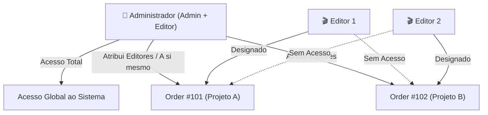
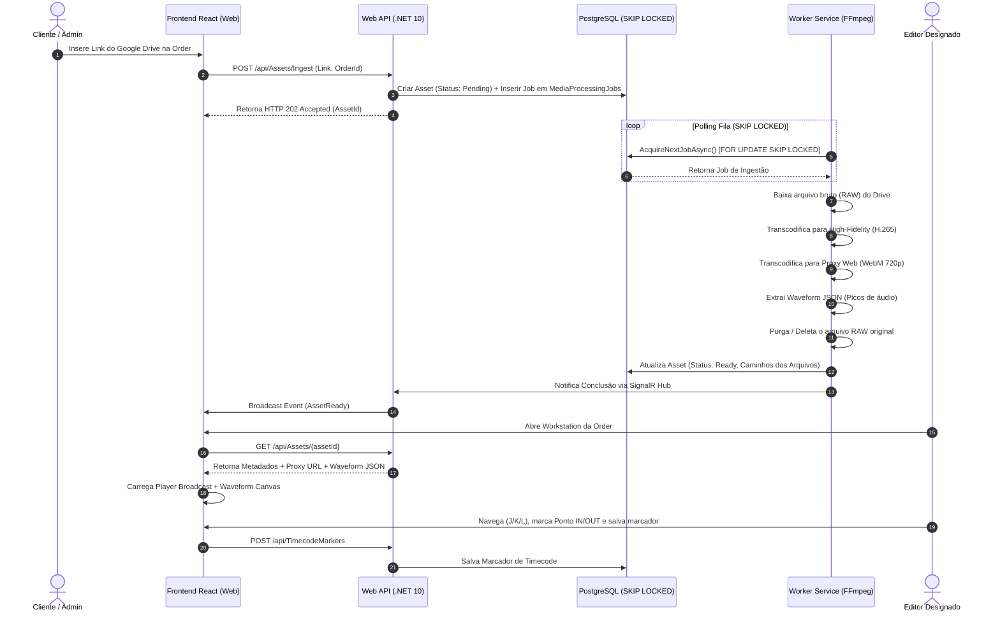

# Media 8 | Workstation — Product Requirement Document (PRD)

> **Módulo PAM (Production Asset Management) & Workstation de Edição do Ecossistema Media 8**  
> *Versão:* 1.0.0  
> *Status:* Aprovado  
> *Data:* Julho de 2026  

---

## 1. Visão Geral do Produto

O **Media 8 | Workstation** é uma solução de **Production Asset Management (PAM)** e esteira de suporte à edição de vídeos projetada especificamente para pequenas agências de audiovisual, produtoras enxutas e editores autônomos. 

Integrado ao ecossistema Media 8 (onde cada projeto de cliente é tratado como uma **Order**), o Workstation resolve o gargalo de ingestão, transcodificação, organização e seleção de mídias brutas (*RAW*), fornecendo uma interface rica de pré-edição no navegador conectada diretamente ao briefing do projeto.

---

## 2. O Problema de Negócio & A Solução

### 2.1 O Problema
1. **Gargalo de Transferência de Mídias Pesadas:** Editores perdem horas baixando dezenas de gigabytes de arquivos brutos (RAW) em 4K/8K de links do Google Drive ou Dropbox apenas para visualizar o conteúdo e escolher algumas poucas cenas.
2. **Desperdício e Colapso de Armazenamento:** Servidores locais e discos de trabalho ficam lotados com vídeos brutos não otimizados (ex: vídeo de 1 minuto em 8K pesando 20 GB).
3. **Desconexão entre Briefing e Mídias:** Falta de integração direta entre o documento de instruções/roteiro (briefing) e os marcadores de tempo (Timecode) das mídias enviadas.
4. **Complexidade Excessiva dos PAMs Tradicionais:** Sistemas como Dalet Flex ou Avid Interplay são desenhados para emissoras de TV com petabytes de acervo, fitas LTO e sinais ao vivo SDI, sendo inviáveis e sobrecarregados para agências e freelancers.

### 2.2 A Solução
Uma plataforma web minimalista, ultra-performática e desacoplada que:
- Recebe links externos de mídias brutas.
- Processa o download de forma assíncrona via Workers C# em segundo plano.
- Gera duas camadas otimizadas de mídia (*High Fidelity* e *Proxy Web*) e descarta o RAW original.
- Apresenta um Player Broadcast com precisão por Timecode (`HH:MM:SS:FF`), forma de onda em Canvas 2D e marcação de sub-clips vinculados ao briefing.
- Permite o download de recortes (Sub-clips) em alta fidelidade ou da mídias inteiras otimizadas.
- Limpa o armazenamento local do servidor ao final da entrega da Order.

---

## 3. Controle de Acesso e Governança (RBAC)

O sistema adota um modelo estrito de segurança e privacidade baseado em papéis:

### 3.1 Níveis de Usuário

#### 👑 Administrador (Admin)
- **Acesso Global:** Visualiza, cria, edita e gerencia todas as Orders, mídias e configurações globais do sistema.
- **Acúmulo de Papel (Admin + Editor):** Possui todas as funcionalidades operacionais de um editor em qualquer projeto do sistema.
- **Gestão de Atribuições:** É o único papel responsável por atribuir editores a cada Order (podendo atribuir a si próprio ou a terceiros).

#### 🎬 Editor (Editor)
- **Escopo Delimitado:** Acessa **apenas e exclusivamente** os projetos (Orders) para os quais foi formalmente atribuído por um Administrador.
- **Operação Completa na Order:** Dentro dos seus projetos atribuídos, possui acesso total às ferramentas: visualização no player proxy, marcação de timecode IN/OUT, criação de anotações, visualização de briefing, download de sub-clips e solicitação de arquivos em High Fidelity.
- **Isolamento Total:** Não enxerga projetos de outros editores nem configurações globais.

---

## 4. Requisitos Funcionais (RF)

### 4.1 Ingestão e Pipeline de Mídias
- **RF-001 [Ingestão via Links]:** O usuário (Admin ou Editor atribuído) cola links de pastas ou arquivos externos (ex: Google Drive). A API registra o pedido com status `Pending` e enfileira o download.
- **RF-002 [Download Assíncrono]:** O Worker de Ingestão baixa o arquivo bruto diretamente do storage externo via stream sem bloquear a API REST.
- **RF-003 [Transcodificação Dual-Layer]:**
  - **Layer 1 — High Fidelity (Não-RAW):** Converte o vídeo RAW para um codec de arquivo/edição otimizado (ex: H.265 / ProRes de alto bitrate), reduzindo o tamanho em disco sem perda de qualidade perceptível para a renderização final.
  - **Layer 2 — Visualização Proxy (Web):** Converte para formatos leves e nativos da Web (WebM/AV1 para vídeo, WebP para imagens, Opus para áudio) em resolução reduzida (ex: 720p/1080p).
  - **Waveform Data:** Extrai os picos de áudio do arquivo e salva em um arquivo JSON compacto.
- **RF-004 [Purga Defensiva do RAW]:** Após a confirmação da integridade e criação das camadas *High Fidelity* e *Proxy*, o Worker deleta o arquivo RAW original do disco.
- **RF-005 [Purga Final da Order]:** Quando a Order é marcada como **Concluída/Entregue**, uma rotina de purga remove os arquivos locais de High Fidelity e Proxies do servidor, mantendo apenas os metadados e marcadores no banco de dados.

### 4.2 Interface da Workstation (Frontend)
- **RF-006 [Player Broadcast Timecode]:** Player web preciso por quadro (frame-accurate) com exibição de timecode no padrão `HH:MM:SS:FF`.
- **RF-007 [Navegação por Atalhos de Teclado]:** Suporte aos atalhos padrão da indústria:
  - `J`: Retroceder velocidade (1x, 2x, 4x)
  - `K`: Pausar / Reproduzir
  - `L`: Avançar velocidade (1x, 2x, 4x)
  - `Seta Esquerda / Direita`: Mover 1 frame para trás / frente
  - `I`: Marcar Ponto de Entrada (IN)
  - `O`: Marcar Ponto de Saída (OUT)
- **RF-008 [Renderizador de Waveform em Canvas]:** Exibição gráfica da forma de onda do áudio em Canvas 2D. O clique no Canvas move instantaneamente o cursor de reprodução do vídeo.
- **RF-009 [Marcadores e Sub-clips (IN/OUT)]:** Permitir salvar trechos demarcados com rasteio de Timecode (`InTimecode`, `OutTimecode`), rótulo, cor e notas de edição.
- **RF-010 [Integração Briefing ↔ Timecode]:** Exibição do texto de briefing da Order lado a lado com os marcadores de timecode. Clicar em um ponto mencionado no briefing salta o player para o frame correspondente.
- **RF-011 [Download Otimizado por Sub-clip]:** Permitir que o editor solicite o download de apenas um sub-clip específico. O Worker corta assincronamente o trecho demarcarado em High Fidelity e entrega um arquivo ZIP leve.
- **RF-012 [Notificações em Tempo Real]:** Transmissão via SignalR (WebSockets) do progresso percentual de download, geração de proxy e conclusão de trabalhos.

---

## 5. Requisitos Não-Funcionais (RNF)

- **RNF-001 [Backend é LEI — PascalCase Rigoroso]:** A API .NET 10 impõe a serialização JSON nativa em `PascalCase`. O frontend React espelha exatamente esses contratos em suas interfaces TypeScript.
- **RNF-002 [Database-as-a-Queue (SKIP LOCKED)]:** A fila de processamento de background de mídias é gerenciada nativamente no PostgreSQL utilizando `SELECT ... FOR UPDATE SKIP LOCKED`, eliminando a necessidade de brokers como RabbitMQ ou Redis na versão V1.
- **RNF-003 [Clean Architecture & Segregação de Escopos]:** O backend é estruturado em camadas (`Domain`, `Application`, `Infrastructure`, `Api`, `Workers`). Prompts de desenvolvimento e commits devem ser estritamente atômicos e por escopo.
- **RNF-004 [Prontidão para Conteinerização (Docker Ready)]:** Toda a solução é executável via `docker-compose.yml`, com variáveis de ambiente centralizadas em um único `.env` na raiz.
- **RNF-005 [Desempenho de Leitura de Mídias Web]:** O vídeo de visualização proxy deve iniciar a reprodução em menos de 1.5 segundos na interface via suporte a streaming de chunks HTTP (`movflags +faststart`).

---

## 6. Fluxo de Trabalho Fim a Fim (Workflow)

